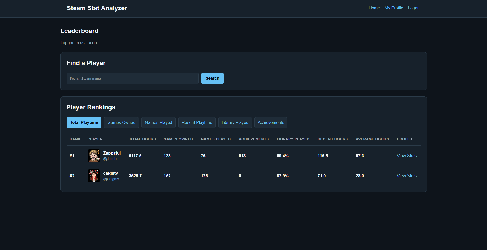
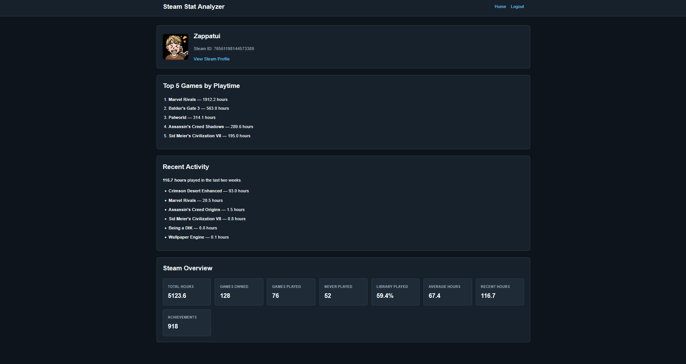
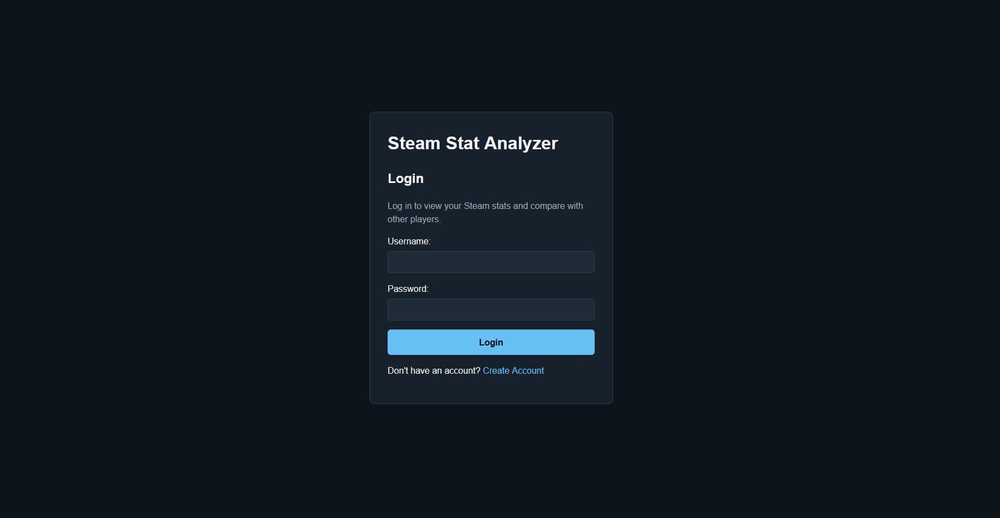

# Steam Stat Analyzer

Steam Stat Analyzer is a Django web application that connects to the Steam Web API to analyze player libraries, display profile statistics, and compare registered users through a sortable leaderboard.

The project was built as a portfolio application to practice full-stack web development with Python and Django, including authentication, database modeling, external API integration, data processing, caching, and responsive frontend styling.

## Features

* User registration and login with Django authentication
* Link one Steam profile to each site account
* Steam custom URL, profile URL, and SteamID64 support
* Steam profile overview pages
* Total games owned
* Games played and unplayed
* Total lifetime playtime
* Average playtime per played game
* Percentage of library played
* Recent Steam activity
* Top five games by playtime
* Achievement tracking
* Sortable player leaderboard
* Steam profile search
* Cached Steam statistics stored in the database
* Responsive custom CSS interface

## Screenshots

### Leaderboard



### Player Profile



### Login



## Tech Stack

* Python
* Django
* HTML
* CSS
* SQLite
* Steam Web API
* Requests
* python-dotenv
* Git
* GitHub

## How It Works

Steam Stat Analyzer uses Django to manage routing, authentication, templates, and database storage.

Steam profile data is retrieved through the Steam Web API and processed in Python before being displayed to the user.

Important statistics are stored in the local database so the leaderboard can be loaded and sorted without requesting every player's entire Steam library each time the page loads.

The application separates API and data-processing logic into service functions so the same Steam functionality can be reused across account creation, player profiles, and leaderboard updates.

## Local Setup

Clone the repository:

```bash
git clone https://github.com/JacobZapp/Steam_Stat_Analyzer.git
```

Move into the project directory:

```bash
cd Steam_Stat_Analyzer
```

Create and activate a Python virtual environment.

Windows:

```bash
python -m venv venv
venv\Scripts\activate
```

Install dependencies:

```bash
pip install -r requirements.txt
```

Create a `.env` file in the project root:

```text
STEAM_API_KEY=your_steam_api_key
```

The `.env` file is excluded from Git and should never be committed.

Run database migrations:

```bash
python manage.py migrate
```

Start the development server:

```bash
python manage.py runserver
```

Open:

```text
http://127.0.0.1:8000/
```

## Steam API Requirements

A Steam Web API key is required.

Steam profile and game privacy settings can affect which statistics are available. Some achievement or game information may not be returned for profiles with restricted Steam privacy settings.

## Project Structure

```text
Steam_Stat_Analyzer/
├── accounts/
│   ├── migrations/
│   ├── templates/
│   ├── forms.py
│   ├── models.py
│   ├── services.py
│   ├── urls.py
│   └── views.py
│
├── analyzer/
│   ├── static/
│   ├── templates/
│   ├── services.py
│   ├── urls.py
│   └── views.py
│
├── config/
│   ├── settings.py
│   └── urls.py
│
├── manage.py
├── requirements.txt
└── README.md
```

## What I Practiced

This project gave me hands-on experience with:

* Django project and application architecture
* URL routing and dynamic URLs
* Django templates
* Authentication and sessions
* Django forms
* Database models and migrations
* Django ORM queries
* One-to-one model relationships
* External REST API integration
* JSON data processing
* Environment variables and API key protection
* Service-layer refactoring
* Database-backed caching of API statistics
* Search and sorting
* Error handling
* Responsive CSS
* Git and GitHub workflow

## Future Improvements

Possible future additions include:

* Improved handling of private Steam achievement data
* Automatic scheduled statistic refreshes
* Additional achievement analytics
* Perfect-game tracking
* More detailed game statistics
* Automated tests
* Production deployment
* PostgreSQL production database

## Status

Steam Stat Analyzer is a working portfolio project that is still open to future improvements and additional Steam analytics.
